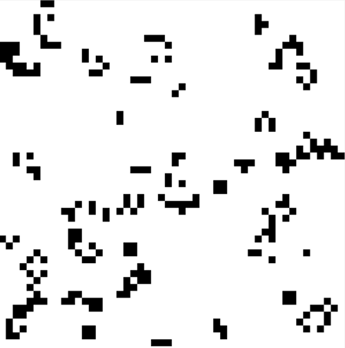

# Game of Life

Very realistic life simulation. See it running live at
[clojure-rica.github.io](http://clojure-rica.github.io).



## Usage

Grab the code:

```bash
$ git clone https://github.com/clojure-rica/game-of-life.git
$ cd game-of-life
```

Compile it:

```bash
$ lein cljsbuild once
```

And take a peek:

```bash
$ open site/index.html
```

## Contributing
Please see the [Contributing
Document](https://github.com/clojure-rica/game-of-life/blob/master/CONTRIBUTING.md)

## License
Copyright (C) 2014 Ben Orenstein, Chris Hunt, [MIT
License](https://github.com/clojure-rica/game-of-life/blob/master/LICENSE.txt)
